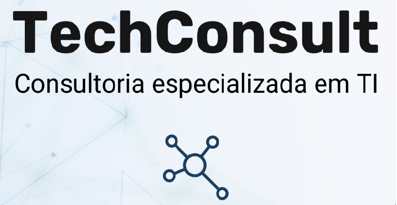
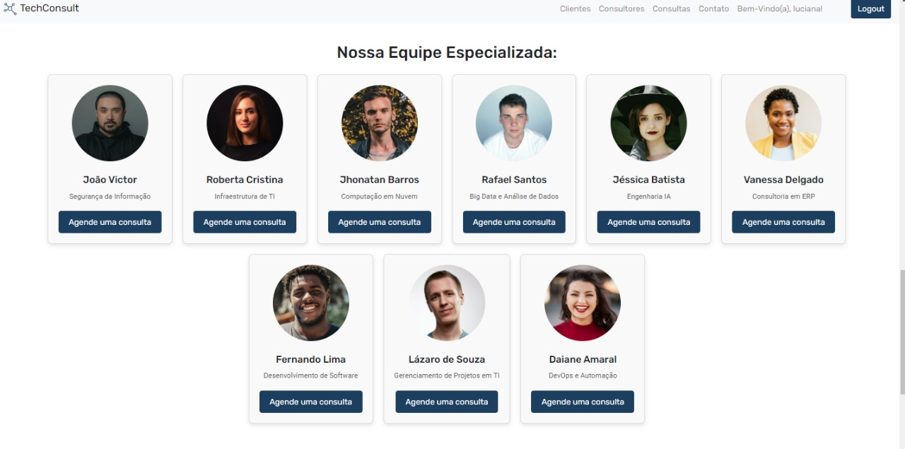

## SQUAD-04 Sistema de Consultoria

### Tech Consult

### Equipe 

- [Luciana](https://github.com/Lucianapoppi)
- [Fabricio](https://github.com/fabriciofragoso00)
- [Washiner](https://github.com/washiner)
- [Douglas](https://github.com/douglascuelho)
- [Matheus](https://github.com/matheusandre1)

## Objetivo

Foi exibir as principais informações da empresa que presta consultorias em diversos especialidades em Tecnologia e Computação.

O Projeto atende com :
## Personalização de Serviços:
 Nosso site oferece soluções de consultoria personalizadas, adaptadas às necessidades específicas de usuários individuais e empresas.
Os serviços de consultoria são moldados de acordo com os objetivos e desafios únicos de cada cliente, garantindo resultados eficazes.

## Interface Intuitiva:
"A interface do nosso site é intuitiva e fácil de navegar, permitindo que tanto indivíduos quanto empresas encontrem rapidamente as informações e serviços de que precisam."
Com um design responsivo, o site oferece uma experiência de usuário consistente e agradável em todos os dispositivos."

## Acesso a Consultores Especializados
"Conecte-se com consultores especializados em diversas áreas, prontos para oferecer orientação e soluções estratégicas."
"Empresas e usuários podem agendar consultas com profissionais experientes que entendem suas necessidades específicas."

## Feedback

Nosso site inclui uma plataforma de feedback, onde usuários e empresas podem compartilhar suas experiências e sugestões para melhorar continuamente nossos serviços."
"Valorizamos a opinião dos nossos clientes e utilizamos o feedback para aprimorar nossos serviços e atendimento."

## Funcionalidades

- ### Registros de Clientes :
 Com validação de formulário, coletando nome, e-
mail, telefone e empresa. Armazenamento dos dados em um banco de dados no PostgreSQL.
- ### Perfis de Clientes: 
Possibilidade de criar, visualizar e editar perfis. Os perfis incluem 
informações básicas, histórico de consultas e feedbacks.
- ### Consultores:
 CRUD para gerenciar consultores. Inclusão de informações detalhadas sobre cada
consultor, como nome, especialização, experiência e contato. Os dados serão armazenados no banco
de dados.
- ### Consultas:
 Para gerenciar agendamentos de consultas. Permitir que os clientes agendem,
visualizem e cancelem consultas com consultores. Os agendamentos serão salvos no banco de dados.

- ### Relatórios de Consultoria:
 CRUD para gerenciar relatórios de consultoria. Permitir que os consultores
criem, editem e visualizem relatórios detalhados de cada consulta. Os relatórios serão salvos no banco
de dados.

- ### Login e Autentificação Simples

- ### Parte de Inserção de Banco de Imagem.
## Stack utilizada

**Front-end:** HTML, CSS , Bootstrap, Javascript

**Back-end:** Java, Spring Boot , PostGreSQL

## Arquitetura e Design

Utilizamos MVC Com suas Camadas Bem Definidas fazendo o uso de Desacoplamento das Interfaces do Usuário, Os Dados  e da Logica de Negocio.

